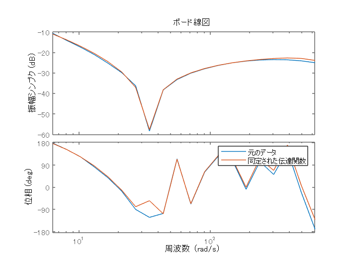

# むだ時間を含むシステムに対して適応MPCを設計
# 初期化
```matlab
system_model_name = 'BallAndPlate_system';
ampc_controller_name = 'BallAndPlate_AMPC_Controller';

SDI_view_path = which('circle_move_XY_view.mldatx');

Ts = get_slddVal('BallAndPlate_system_data.sldd', 'TimeStep_MPC');

set_slddVal('BallAndPlate_system_data.sldd', 'DELAYMODE', 'ENUM_DELAYMODE.ON');
set_slddVal('BallAndPlate_system_data.sldd', 'SIMMODE', 'ENUM_SIMMODE.PID_CIRCLE');
```
# PID制御による円軌道追従制御

まず最初にPID制御による制御性能を確認する。以下のコマンドを実行する。


むだ時間が無かった時と比べて、指令値との偏差や位相遅れが拡大していることがわかる。

```matlab
open_system(system_model_name);
sim(system_model_name);
Simulink.sdi.view;
Simulink.sdi.clearPreferences;
Simulink.sdi.loadView(SDI_view_path);
```
# 周波数応答推定器を用いた内部モデルの構築

周波数応答推定器用いてむだ時間を含む伝達関数モデルを推定する。


まず、推定試験を実行し、データを得る。

```matlab
set_slddVal('BallAndPlate_system_data.sldd', 'SIMMODE', 'ENUM_SIMMODE.PID_FRE');

open_system(system_model_name);
simout = sim(system_model_name);
plot_ball_results_in_SDI;
```

得られたデータのボード線図を確認する。

```matlab
frd_results_c = simout.logsout.get('frd').Values.Data(end, :);
est_point_num = numel(frd_results_c);
frd_results = zeros(est_point_num, 2);
frd_results(:, 1) = 20 * log10(abs(frd_results_c));
frd_results(:, 2) = 180 / pi * angle(frd_results_c);
x = logspace(0, 2, est_point_num);

tiledlayout(2,1);
nexttile;
semilogx(x, frd_results(:, 1), 'o');
title('ゲイン[dB]');
nexttile;
semilogx(x, frd_results(:, 2), 'o');
title('位相[deg]');
```


```matlab
figure;
```

伝達関数モデルを同定する。

```matlab
frd_x = 2 * pi * x;
ts = get_slddVal('BallAndPlate_system_data.sldd', 'TimeStep_PID_fast');
delay_time = get_slddVal('BallAndPlate_system_data.sldd', ...
    'angle_signal_transport_delay_time');

frd_data_set = idfrd(frd_results_c, frd_x, ts);

pole_idx = 2:6;
k_max = 0;
for i = 1:numel(pole_idx)
    k_max = k_max + pole_idx(i) - 1;
end

estimated_model = cell(k_max, 1);
k = 1;
for i = 1:numel(pole_idx)
    for j = 1:(pole_idx(i) - 1)
        init_sys = idtf(NaN(1,j), [1, NaN(1,i)], 'InputDelay', delay_time);
        init_sys.Structure(1).Denominator.Minimum = [-inf(1, i), 0];
        init_sys.Structure(1).Denominator.Maximum = [inf(1, i), 0];

        estimated_model{k} = tfest(frd_data_set, init_sys);
        k = k + 1;
    end
end

```

```matlab
fit_vec = zeros(numel(estimated_model), 1);
fit_percent = 0;
max_fit_index = 0;
for i = 1:numel(estimated_model)
    fit_vec(i) = estimated_model{i, 1}.Report.Fit.FitPercent;
    if (fit_percent < fit_vec(i))
        fit_percent = fit_vec(i);
        max_fit_index = i;
    end
end

plot(fit_vec);
```


```matlab
figure;
```

6, 10, 15が最も一致している。ここで、これらの伝達関数のボード線図と推定試験で得られたボード線図を比較する。

```matlab
plot_option = bodeoptions('cstprefs');
plot_option.PhaseWrapping = 'on';

better_model_1 = estimated_model{6}
```

```matlabTextOutput
better_model_1 =
 
                18.83 s^2 - 110.2 s + 1.587e04
  exp(-0.2*s) * ------------------------------
                   s^3 + 350.4 s^2 + 8623 s
 
同定された連続時間伝達関数です。

パラメーター化:
   極の数: 3   零点の数: 2
   自由係数の数: 6
   パラメーターとその不確かさについては、"tfdata"、"getpvec"、"getcov" を使用してください。

状態:                                          
周波数応答データ "frd_data_set" に TFEST を使用して推定されました。
推定データへの適合: 73.96%                            
FPE: 0.001002, MSE: 0.0005396                
```

```matlab
bode(frd_data_set, better_model_1, frd_x, plot_option);
legend('元のデータ', '同定された伝達関数');
```


```matlab
better_model_2 = estimated_model{10}
```

```matlabTextOutput
better_model_2 =
 
                -14.35 s^3 + 1.386e04 s^2 - 7.75e04 s + 1.182e07
  exp(-0.2*s) * ------------------------------------------------
                  s^4 + 457.9 s^3 + 2.995e05 s^2 + 6.349e06 s
 
同定された連続時間伝達関数です。

パラメーター化:
   極の数: 4   零点の数: 3
   自由係数の数: 8
   パラメーターとその不確かさについては、"tfdata"、"getpvec"、"getcov" を使用してください。

状態:                                          
周波数応答データ "frd_data_set" に TFEST を使用して推定されました。
推定データへの適合: 87.01%                            
FPE: 0.0003131, MSE: 0.0001342               
```

```matlab
bode(frd_data_set, better_model_2, frd_x, plot_option);
legend('元のデータ', '同定された伝達関数');
```


```matlab
best_fit_model = estimated_model{max_fit_index}
```

```matlabTextOutput
best_fit_model =
 
                -35.57 s^4 + 2.256e04 s^3 + 7.784e05 s^2 + 2.715e07 s + 9.024e08
  exp(-0.2*s) * ----------------------------------------------------------------
                    s^5 + 930.2 s^4 + 4.39e05 s^3 + 4.372e07 s^2 + 4.48e08 s
 
同定された連続時間伝達関数です。

パラメーター化:
   極の数: 5   零点の数: 4
   自由係数の数: 10
   パラメーターとその不確かさについては、"tfdata"、"getpvec"、"getcov" を使用してください。

状態:                                          
周波数応答データ "frd_data_set" に TFEST を使用して推定されました。
推定データへの適合: 94.56%                            
FPE: 7.065e-05, MSE: 2.355e-05               
```

```matlab
bode(frd_data_set, best_fit_model, frd_x, plot_option);
legend('元のデータ', '同定された伝達関数');
```



最も次数の低いモデルを選択し、(1/s)とむだ時間を追加し、伝達関数を完成させる。

```matlab
estimated_BallAndPlate_transfer_function = tf(better_model_1.Numerator, ...
    [better_model_1.Denominator, 0], 'InputDelay', delay_time)
```

```matlabTextOutput
estimated_BallAndPlate_transfer_function =
 
                18.83 s^2 - 110.2 s + 1.587e04
  exp(-0.2*s) * ------------------------------
                  s^4 + 350.4 s^3 + 8623 s^2
 
連続時間の伝達関数です。
```
# 適応MPCを設計

得られた伝達関数モデルを内部モデルとしてAdaptive MPCを構成する。むだ時間は、以下のように「absorbDelay」コマンドを用いて離散の伝達関数の中に組み込むものとする。

```matlab
set_slddVal('BallAndPlate_system_data.sldd', 'SIMMODE', 'ENUM_SIMMODE.MPC_A');

BallAndPlate_1aixs_tf_d = c2d(estimated_BallAndPlate_transfer_function, Ts);
BallAndPlate_1aixs_tf_dd = absorbDelay(BallAndPlate_1aixs_tf_d)
```

```matlabTextOutput
BallAndPlate_1aixs_tf_dd =
 
      0.0007822 z^3 - 0.001283 z^2 + 0.0006886 z + 0.000116
  -------------------------------------------------------------
  z^14 - 2.589 z^13 + 2.178 z^12 - 0.5904 z^11 + 0.0009048 z^10
 
サンプル時間:  0.02 seconds
離散時間の伝達関数です。
```

```matlab
BallAndPlate_ss_d = ss([BallAndPlate_1aixs_tf_dd, 0; 0, BallAndPlate_1aixs_tf_dd])
```

```matlabTextOutput
BallAndPlate_ss_d =
 
  A = 
                x1          x2          x3          x4          x5          x6          x7          x8          x9
   x1        2.589      -1.089      0.5904  -0.0009048           0           0           0           0           0
   x2            2           0           0           0           0           0           0           0           0
   x3            0         0.5           0           0           0           0           0           0           0
   x4            0           0           1           0           0           0           0           0           0
   x5            0           0           0           1           0           0           0           0           0
   x6            0           0           0           0           1           0           0           0           0
   x7            0           0           0           0           0           1           0           0           0
   x8            0           0           0           0           0           0           1           0           0
   x9            0           0           0           0           0           0           0           1           0
   x10           0           0           0           0           0           0           0           0           1
   x11           0           0           0           0           0           0           0           0           0
   x12           0           0           0           0           0           0           0           0           0
   x13           0           0           0           0           0           0           0           0           0
   x14           0           0           0           0           0           0           0           0           0
   x15           0           0           0           0           0           0           0           0           0
   x16           0           0           0           0           0           0           0           0           0
   x17           0           0           0           0           0           0           0           0           0
   x18           0           0           0           0           0           0           0           0           0
   x19           0           0           0           0           0           0           0           0           0
   x20           0           0           0           0           0           0           0           0           0
   x21           0           0           0           0           0           0           0           0           0
   x22           0           0           0           0           0           0           0           0           0
   x23           0           0           0           0           0           0           0           0           0
   x24           0           0           0           0           0           0           0           0           0
   x25           0           0           0           0           0           0           0           0           0
   x26           0           0           0           0           0           0           0           0           0
   x27           0           0           0           0           0           0           0           0           0
   x28           0           0           0           0           0           0           0           0           0
 
               x10         x11         x12         x13         x14         x15         x16         x17         x18
   x1            0           0           0           0           0           0           0           0           0
   x2            0           0           0           0           0           0           0           0           0
   x3            0           0           0           0           0           0           0           0           0
   x4            0           0           0           0           0           0           0           0           0
   x5            0           0           0           0           0           0           0           0           0
   x6            0           0           0           0           0           0           0           0           0
   x7            0           0           0           0           0           0           0           0           0
   x8            0           0           0           0           0           0           0           0           0
   x9            0           0           0           0           0           0           0           0           0
   x10           0           0           0           0           0           0           0           0           0
   x11           1           0           0           0           0           0           0           0           0
   x12           0           1           0           0           0           0           0           0           0
   x13           0           0           1           0           0           0           0           0           0
   x14           0           0           0           1           0           0           0           0           0
   x15           0           0           0           0           0       2.589      -1.089      0.5904  -0.0009048
   x16           0           0           0           0           0           2           0           0           0
   x17           0           0           0           0           0           0         0.5           0           0
   x18           0           0           0           0           0           0           0           1           0
   x19           0           0           0           0           0           0           0           0           1
   x20           0           0           0           0           0           0           0           0           0
   x21           0           0           0           0           0           0           0           0           0
   x22           0           0           0           0           0           0           0           0           0
   x23           0           0           0           0           0           0           0           0           0
   x24           0           0           0           0           0           0           0           0           0
   x25           0           0           0           0           0           0           0           0           0
   x26           0           0           0           0           0           0           0           0           0
   x27           0           0           0           0           0           0           0           0           0
   x28           0           0           0           0           0           0           0           0           0
 
               x19         x20         x21         x22         x23         x24         x25         x26         x27
   x1            0           0           0           0           0           0           0           0           0
   x2            0           0           0           0           0           0           0           0           0
   x3            0           0           0           0           0           0           0           0           0
   x4            0           0           0           0           0           0           0           0           0
   x5            0           0           0           0           0           0           0           0           0
   x6            0           0           0           0           0           0           0           0           0
   x7            0           0           0           0           0           0           0           0           0
   x8            0           0           0           0           0           0           0           0           0
   x9            0           0           0           0           0           0           0           0           0
   x10           0           0           0           0           0           0           0           0           0
   x11           0           0           0           0           0           0           0           0           0
   x12           0           0           0           0           0           0           0           0           0
   x13           0           0           0           0           0           0           0           0           0
   x14           0           0           0           0           0           0           0           0           0
   x15           0           0           0           0           0           0           0           0           0
   x16           0           0           0           0           0           0           0           0           0
   x17           0           0           0           0           0           0           0           0           0
   x18           0           0           0           0           0           0           0           0           0
   x19           0           0           0           0           0           0           0           0           0
   x20           1           0           0           0           0           0           0           0           0
   x21           0           1           0           0           0           0           0           0           0
   x22           0           0           1           0           0           0           0           0           0
   x23           0           0           0           1           0           0           0           0           0
   x24           0           0           0           0           1           0           0           0           0
   x25           0           0           0           0           0           1           0           0           0
   x26           0           0           0           0           0           0           1           0           0
   x27           0           0           0           0           0           0           0           1           0
   x28           0           0           0           0           0           0           0           0           1
 
               x28
   x1            0
   x2            0
   x3            0
   x4            0
   x5            0
   x6            0
   x7            0
   x8            0
   x9            0
   x10           0
   x11           0
   x12           0
   x13           0
   x14           0
   x15           0
   x16           0
   x17           0
   x18           0
   x19           0
   x20           0
   x21           0
   x22           0
   x23           0
   x24           0
   x25           0
   x26           0
   x27           0
   x28           0
 
  B = 
            u1      u2
   x1   0.0625       0
   x2        0       0
   x3        0       0
   x4        0       0
   x5        0       0
   x6        0       0
   x7        0       0
   x8        0       0
   x9        0       0
   x10       0       0
   x11       0       0
   x12       0       0
   x13       0       0
   x14       0       0
   x15       0  0.0625
   x16       0       0
   x17       0       0
   x18       0       0
   x19       0       0
   x20       0       0
   x21       0       0
   x22       0       0
   x23       0       0
   x24       0       0
   x25       0       0
   x26       0       0
   x27       0       0
   x28       0       0
 
  C = 
             x1        x2        x3        x4        x5        x6        x7        x8        x9       x10       x11
   y1         0         0         0         0         0         0         0         0         0         0   0.01252
   y2         0         0         0         0         0         0         0         0         0         0         0
 
            x12       x13       x14       x15       x16       x17       x18       x19       x20       x21       x22
   y1  -0.02053   0.01102  0.001856         0         0         0         0         0         0         0         0
   y2         0         0         0         0         0         0         0         0         0         0         0
 
            x23       x24       x25       x26       x27       x28
   y1         0         0         0         0         0         0
   y2         0         0   0.01252  -0.02053   0.01102  0.001856
 
  D = 
       u1  u2
   y1   0   0
   y2   0   0
 
サンプル時間:  0.02 seconds
離散時間状態空間モデル。
```

```matlab
set_slddVal('BallAndPlate_system_data.sldd', 'EKF_x_num', size(BallAndPlate_ss_d.A, 1));
set_slddVal('BallAndPlate_system_data.sldd', 'EKF_u_num', size(BallAndPlate_ss_d.B, 2));
set_slddVal('BallAndPlate_system_data.sldd', 'EKF_y_num', size(BallAndPlate_ss_d.C, 1));
```

MPCオブジェクトを作成する。

```matlab
mpcObj = mpc(BallAndPlate_ss_d, Ts);
```

```matlabTextOutput
-->"PredictionHorizon" プロパティが空です。既定の 10 を仮定します。
-->"ControlHorizon" プロパティが空です。既定の 2 を仮定します。
-->"Weights.ManipulatedVariables" プロパティが空です。既定の 0.00000 を仮定します。
-->"Weights.ManipulatedVariablesRate" プロパティが空です。既定の 0.10000 を仮定します。
-->"Weights.OutputVariables" プロパティが空です。既定の 1.00000 を仮定します。
```

```matlab
% 予測ホライズンと制御ホライズン
mpcObj.PredictionHorizon = 60;
mpcObj.ControlHorizon = 4;
set_slddVal('BallAndPlate_system_data.sldd', ...
    'MPC_PredictionHorizon', mpcObj.PredictionHorizon);

setEstimator(mpcObj, 'custom');

% サーボ角度指令値の上下限制約 
mpcObj.ManipulatedVariables(1).Max = 90;
mpcObj.ManipulatedVariables(2).Max = 90;
mpcObj.ManipulatedVariables(1).Min = -90;
mpcObj.ManipulatedVariables(2).Min = -90;

% 最適化の重み
mpcObj.Weights.OutputVariables = [2, 2];
mpcObj.Weights.ManipulatedVariables = [0.1, 0.1];
mpcObj.Weights.ManipulatedVariablesRate = [0, 0];
```

ステップ指令値に対するモデルの応答を確認する。


指令値に問題なく追従できていることがわかる。

```matlab
open_system(system_model_name);
sim(system_model_name);
```

```matlabTextOutput
   測定出力チャネル #1 に外乱が追加されていないと仮定します。
   測定出力チャネル #2 に外乱が追加されていないと仮定します。
-->"Model.Noise" プロパティが空です。それぞれの測定出力にホワイト ノイズを仮定します。
```

```matlab
plot_ball_results_in_SDI;
```
# 円軌道指令値に対する追従性能を確認

最後に、円軌道に対する追従性を確認する。必要であれば以下にてパラメーターを調整すること。

```matlab
set_slddVal('BallAndPlate_system_data.sldd', 'SIMMODE', 'ENUM_SIMMODE.MPC_A_TR');

% 予測ホライズンと制御ホライズン
mpcObj.PredictionHorizon = 30;
mpcObj.ControlHorizon = 2;
set_slddVal('BallAndPlate_system_data.sldd', ...
    'MPC_PredictionHorizon', mpcObj.PredictionHorizon);

% set_slddVal('BallAndPlate_system_data.sldd', 'offset_free_I_gain', 0.01);
```

モデルを実行し、結果を確認する。


偏差も少なく、指令値に対して遅れなく追従できていることがわかる。

```matlab
sim(system_model_name);
Simulink.sdi.view;
Simulink.sdi.clearPreferences;
Simulink.sdi.loadView(SDI_view_path);
```


*Copyright 2022 The MathWorks, Inc.*


