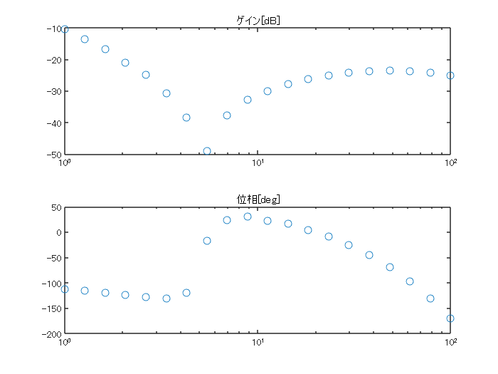

# 周波数応答推定器によるプラントモデルの推定
# 初期化
```matlab
system_model_name = 'BallAndPlate_system';
controller_model_name = 'BallAndPlate_PID_FRE_Controller';

set_slddVal('BallAndPlate_system_data.sldd', 'DELAYMODE', 'ENUM_DELAYMODE.OFF');
set_slddVal('BallAndPlate_system_data.sldd', 'SIMMODE', 'ENUM_SIMMODE.PID_FRE');
```
# 周波数応答推定器を用いた内部モデルの構築

ここでは、Simulink Control Design™ の「Frequency Response Estimator」ブロックを用いてプラントモデルの伝達関数の推定を行う。


このブロックは、プラントモデルに一定時間擾乱を加え、その時の応答を計測することで、そのプラントモデルのボード線図を得ることができる。この操作はフィードバック制御を実行しながら行うこともできる。また、この推定機能をCコード生成し、コントローラーに組み込むことで実機に対しても推定を行うことができる。

# 推定試験を実行

今回のプラントモデルは、X軸、Y軸に対してそれぞれ独立したシステムであり、同一な物理構造であるため、X軸に対してのみ推定試験を行い、その結果を複製してY軸に適用することにする。


また、このプラントモデルはサーボ角度（操作量）に対してボールの位置（制御量）が2階積分の関係にあるため、そのままでは周波数特性が得られにくい。従って、「Frequency Response Estimator」ブロックのyポートには、位置を時間微分した速度を入力する。


以降の処理では、この速度の伝達関数を推定する。その後、最終的に得られた伝達関数に対して (1/s) をかけることで、元のプラントモデルの伝達関数を得ることができる。


以下のコマンドを実行することで、モデルを開いて推定試験を実行する。

```matlab
open_system(system_model_name);
simout = sim(system_model_name);
plot_ball_results_in_SDI;
```
# 記録された周波数応答データを整理する

実行後、得られたボード線図のプロットを取り出す。

```matlab
frd_results_c = simout.logsout.get('frd').Values.Data(end, :);
est_point_num = numel(frd_results_c);
```

ここで、そのボード線図を確認する。

```matlab
frd_results = zeros(est_point_num, 2);

frd_results(:, 1) = 20 * log10(abs(frd_results_c));
frd_results(:, 2) = 180 / pi * angle(frd_results_c);
x = logspace(0, 2, est_point_num);

tiledlayout(2,1);
nexttile;
semilogx(x, frd_results(:, 1), 'o');
title('ゲイン[dB]');
nexttile;
semilogx(x, frd_results(:, 2), 'o');
title('位相[deg]');
```



```matlab
figure;
```
# 周波数応答データから伝達関数を同定する

上記で得られたボード線図のプロットから、System Identification Toolbox™ の機能を用いて伝達関数を同定する。


データを「idfrd」オブジェクトに格納し、「tfest」コマンドにより同定を行う。この時、ある特定の極の次数の範囲に対して総当たりで推定を実行する。厳密にプロパーなモデルにするため、零点は極の次数よりも少ない範囲で変化させる。

```matlab
frd_x = 2 * pi * x;
ts = get_slddVal('BallAndPlate_system_data.sldd', 'TimeStep_PID_fast');

frd_data_set = idfrd(frd_results_c, frd_x, ts);

pole_idx = 2:6;
k_max = 0;
for i = 1:numel(pole_idx)
    k_max = k_max + pole_idx(i) - 1;
end

estimated_model = cell(k_max, 1);
k = 1;
for i = 1:numel(pole_idx)
    for j = 1:(pole_idx(i) - 1)
        init_sys = idtf(NaN(1,j), [1, NaN(1,i)]);
        init_sys.Structure(1).Denominator.Minimum = [-inf(1, i), 0];
        init_sys.Structure(1).Denominator.Maximum = [inf(1, i), 0];

        estimated_model{k} = tfest(frd_data_set, init_sys);
        k = k + 1;
    end
end

```

次に、得られた伝達関数の中で最もFitしたモデルを探す。Fit率とAICをグラフ化して確認する。

```matlab
fit_vec = zeros(numel(estimated_model), 1);
AIC_vec = zeros(numel(estimated_model), 1);
fit_percent = 0;
max_fit_index = 0;
for i = 1:numel(estimated_model)
    fit_vec(i) = estimated_model{i, 1}.Report.Fit.FitPercent;
    AIC_vec(i) = estimated_model{i, 1}.Report.Fit.AIC;
    if (fit_percent < fit_vec(i))
        fit_percent = fit_vec(i);
        max_fit_index = i;
    end
end

plot(fit_vec);
```


```matlab
plot(AIC_vec);
```


```matlab
figure;
```

6, 10, 15が最も一致している。ここで、これらの伝達関数のボード線図と推定試験で得られたボード線図を比較する。

```matlab
plot_option = bodeoptions('cstprefs');
plot_option.PhaseWrapping = 'on';

better_model_1 = estimated_model{6}
```

```matlabTextOutput
better_model_1 =
 
  19.64 s^2 - 58.89 s + 1.614e04
  ------------------------------
     s^3 + 357.7 s^2 + 8185 s
 
同定された連続時間伝達関数です。

パラメーター化:
   極の数: 3   零点の数: 2
   自由係数の数: 6
   パラメーターとその不確かさについては、"tfdata"、"getpvec"、"getcov" を使用してください。

状態:                                          
周波数応答データ "frd_data_set" に TFEST を使用して推定されました。
推定データへの適合: 73.09%                            
FPE: 0.001025, MSE: 0.0005517                
```

```matlab
bode(frd_data_set, better_model_1, frd_x, plot_option);
legend('元のデータ', '同定された伝達関数');
```


```matlab

better_model_2 = estimated_model{10}
```

```matlabTextOutput
better_model_2 =
 
  -11.29 s^3 + 1.316e04 s^2 - 2.793e04 s + 1.075e07
  -------------------------------------------------
      s^4 + 426 s^3 + 2.803e05 s^2 + 5.36e06 s
 
同定された連続時間伝達関数です。

パラメーター化:
   極の数: 4   零点の数: 3
   自由係数の数: 8
   パラメーターとその不確かさについては、"tfdata"、"getpvec"、"getcov" を使用してください。

状態:                                          
周波数応答データ "frd_data_set" に TFEST を使用して推定されました。
推定データへの適合: 86.7%                             
FPE: 0.0003144, MSE: 0.0001347               
```

```matlab
bode(frd_data_set, better_model_2, frd_x, plot_option);
legend('元のデータ', '同定された伝達関数');
```


```matlab

best_fit_model = estimated_model{max_fit_index}
```

```matlabTextOutput
best_fit_model =
 
  -47.86 s^4 + 2.755e04 s^3 + 1.285e06 s^2 + 3.862e07 s + 1.314e09
  ----------------------------------------------------------------
      s^5 + 1144 s^4 + 5.224e05 s^3 + 5.956e07 s^2 + 6.1e08 s
 
同定された連続時間伝達関数です。

パラメーター化:
   極の数: 5   零点の数: 4
   自由係数の数: 10
   パラメーターとその不確かさについては、"tfdata"、"getpvec"、"getcov" を使用してください。

状態:                                          
周波数応答データ "frd_data_set" に TFEST を使用して推定されました。
推定データへの適合: 95.56%                            
FPE: 4.501e-05, MSE: 1.5e-05                 
```

```matlab

bode(frd_data_set, best_fit_model, frd_x, plot_option);
legend('元のデータ', '同定された伝達関数');
```


次数が高いほどより良くボード線図が一致していることが分かった。モデルの精度が良い方がMPCの性能は向上するが、次数が高いと計算時間が増加するデメリットもあるため、ここでは低い次数でどこまでの性能が得られるかを確認したい。よって今回は、最も次数の低いモデルを選択する。


最後に (1/s) をかける。

```matlab
estimated_BallAndPlate_transfer_function = tf(better_model_1.Numerator, ...
    [better_model_1.Denominator, 0])
```

```matlabTextOutput
estimated_BallAndPlate_transfer_function =
 
  19.64 s^2 - 58.89 s + 1.614e04
  ------------------------------
    s^4 + 357.7 s^3 + 8185 s^2
 
連続時間の伝達関数です。
```

```matlab
save(fullfile(pjObj.RootFolder, 'Data', 'fre_result.mat'), ...
    'estimated_BallAndPlate_transfer_function');
```
# モデルの確認

参考までに、得られたモデルをプラントモデルとして制御した場合の時間応答を確認する。

```matlab
set_slddVal('BallAndPlate_system_data.sldd', 'SIMMODE', 'ENUM_SIMMODE.PID_CHECK_TF');

sim(system_model_name);
plot_ball_results_in_SDI;
```


*Copyright 2022 The MathWorks, Inc.*


